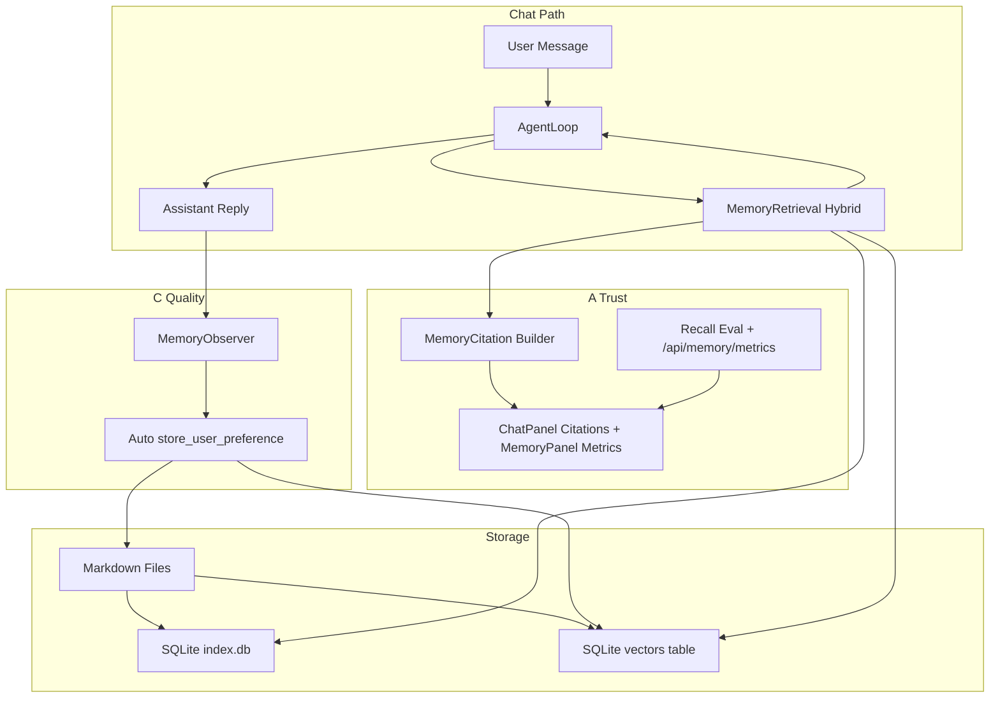

# 记忆信任可解释 + 记忆质量（A+C）设计规格

> **日期:** 2026-06-03  
> **状态:** 待评审  
> **依赖:** [architecture-decision.md](../../architecture-decision.md)（记忆侧车定位）、现有 `MemoryManager` / `HybridRetriever` 主路径

## 1. 目标

在「记忆侧车」定位下，同时解决两类第一性短板：

| 代号 | 问题 | 成功标准 |
|------|------|----------|
| **A 信任可解释** | 用户不知道「这次回答用了哪条记忆、为何选中」 | 3 轮对话内能看懂引用；可查看 Recall@5 |
| **C 记忆质量** | 向量重启丢失；记忆靠模型自觉 `memory_store` | 重启后语义召回不降；对话结束自动沉淀偏好 |

**North Star（与架构决策一致）：**

- Recall@5 ≥ 90%（20 条黄金偏好集）
- 误注入率（无关记忆进 prompt）< 5%
- Time-to-trust ≤ 3 轮（UI 展示完整 citation）

## 2. 非目标（YAGNI）

- 不做 coding agent 工具（shell/git/MCP 宿主）
- 不落地四层 Redis/PG/Chroma 全栈
- 不做 LLM 选记忆（Sonnet rerank）— 本阶段用结构化 citation + 持久向量即可
- 不做独立 BI 大屏；指标先 API + MemoryPanel 子页

## 3. 方案对比与推荐

### A：记忆引用展示

| 方案 | 优点 | 缺点 |
|------|------|------|
| A1 仅扩展现有 `memories_used: string[]` | 改动小 | 无 score/type/id，难纠错 |
| A2 结构化 `MemoryCitation[]` + UI 卡片 | 可解释、可跳转编辑 | 需改 API/前端 |
| A3 独立 ExplainPanel 页 | 信息量大 | 与聊天割裂，超范围 |

**推荐 A2**：在 `ChatResponse` / SSE `done` 事件携带 `MemoryCitation`，ChatPanel 消息下方折叠展示。

### C：向量持久化 + 自动写回

| 方案 | 优点 | 缺点 |
|------|------|------|
| C1 向量序列化进 SQLite（同 `index.db`） | 无新依赖、与现有索引一致 | 大规模时需迁移 |
| C2 引入 Chroma | 专业向量库 | 违背当前侧车轻量决策 |
| C3 仅加强 `memory_store` 提示词 | 零基建 | 召回率仍靠模型自觉 |

**推荐 C1 + 轻量 Observer**：`PersistentVectorStore` 落盘；`MemoryObserver` 在对话轮次结束时规则+可选 LLM 提取写回。

## 4. 架构



## 5. A：信任可解释 — 详细设计

### 5.1 数据模型 `MemoryCitation`

```python
@dataclass
class MemoryCitation:
    memory_id: str
    memory_type: str          # user | feedback | project | reference
    description: str
    content_snippet: str      # 前 200 字
    score: float              # 混合检索综合分
    age_days: int
    is_stale: bool
    selection_reason: str     # e.g. "keyword+vector", "fallback_all_user"
```

### 5.2 Agent / API 变更

- `AgentState.memories_used: List[MemoryCitation]`（替换纯 content 字符串列表）
- `AgentLoop.run`：retrieve 后保留完整 dict，映射为 `MemoryCitation`
- `ChatResponse` 新增字段：`memory_citations: List[MemoryCitation]`
- SSE：在 `done` 事件的 `metadata.citations` 附带同一结构
- `_memory_updates_from_result` 兼容旧字段，优先 citations

### 5.3 前端 `ChatPanel`

- 助手消息下「本次使用的记忆（N）」可折叠区
- 每条：类型标签、description、score、陈旧性警告、链接到 MemoryPanel 高亮（query `?highlight={id}`）
- `showMetadata` 默认 true；无 citation 时显示「未命中记忆」

### 5.4 Recall 评估与指标 API

**黄金集文件：** `tests/fixtures/golden_memories.json`

```json
{
  "user_id": "eval_user",
  "cases": [
    {"store": "喜欢 Python", "query": "写排序", "expect_contains": ["Python"]}
  ]
}
```

**服务：** `src/memory/eval.py`

- `run_recall_eval(user_id, top_k=5) -> RecallReport`
- `RecallReport`: `recall_at_5`, `false_inject_rate`（mock prompt 注入检测）, `cases[]`

**API:**

- `GET /api/memory/metrics?user_id=` → 最近一次 eval + 线上统计（总记忆数、今日召回次数）
- `POST /api/memory/metrics/run-eval` → 触发评估（开发/设置页按钮）

### 5.5 MemoryPanel 扩展

- 新 Tab「质量指标」：Recall@5 进度条、误注入率、上次评估时间、「重新评估」按钮
- 列表记忆支持 `user_id` 过滤（与 export API 对齐）

## 6. C：记忆质量 — 详细设计

### 6.1 持久向量 `PersistentVectorStore`

**表结构（`memories/index.db` 同库）：**

```sql
CREATE TABLE memory_vectors (
  memory_id TEXT PRIMARY KEY,
  embedding BLOB NOT NULL,      -- numpy float32 序列化
  dimension INTEGER NOT NULL,
  user_id TEXT,
  memory_type TEXT,
  updated_at TIMESTAMP
);
```

**行为：**

- `MemoryManager.__init__`：从 DB 加载到内存 `VectorStore`；缺失 embedding 时对 Markdown 内容 backfill
- `store()` 成功後：`upsert` vector 行 + 内存索引
- `delete()`：同步删 vector 行
- 启动时 `rebuild_vectors_if_empty()`：遍历 index 表补向量

仍使用 `local_embed` 作为默认；若配置了 `EmbeddingService`（OpenAI），存储时用 API embedding，检索用同模型。

### 6.2 自动写回 `MemoryObserver`

**触发点：** `AgentLoop.run` 正常结束（`END_TURN` / `MAX_TURNS`）后，`chat.py` 可选调用。

**管道：**

1. **规则提取（必做）**：用户消息含「喜欢/讨厌/偏好/不要用/记住」等 → `store_user_preference` / `store_feedback`
2. **去重**：与最近 24h 同 user 同 content hash 跳过
3. **排除**：走现有 `should_exclude`
4. **可选 LLM 提取（配置开关）**：短 prompt 从 user+assistant 抽 0–2 条可长期记忆；默认关闭

**不写回：** 纯问答、已存在同义记忆、工具失败轮次。

### 6.3 与 A 的衔接

- 自动写回的记忆在下一轮 citation 中可见 `selection_reason: "auto_observer"`
- Metrics 评估集独立 `eval_user`，避免污染 demo-user

## 7. 错误处理

| 场景 | 行为 |
|------|------|
| 向量表损坏 | 日志 + 从 Markdown 全量 rebuild |
| eval 无黄金集 | API 返回 404 + 说明 |
| Observer 存储失败 | 不阻塞 chat 响应；记 warning |
| citation 字段缺失 | 前端降级为旧 `memory_updates` 文本列表 |

## 8. 测试策略

| 测试 | 覆盖 |
|------|------|
| `test_persistent_vector_store.py` | 存取、重启加载、delete 同步 |
| `test_memory_observer.py` | 规则提取、去重、exclude |
| `test_memory_citations.py` | AgentLoop → citation 结构 |
| `test_recall_eval.py` | 黄金集 Recall@5 ≥ 0.9 |
| `test_api_memory_metrics.py` | metrics 端点 |

## 9. 文件清单（实现时）

| 操作 | 路径 |
|------|------|
| Create | `src/memory/citations.py` |
| Create | `src/memory/persistent_vector.py` |
| Create | `src/memory/observer.py` |
| Create | `src/memory/eval.py` |
| Create | `tests/fixtures/golden_memories.json` |
| Modify | `src/memory/manager.py`, `retrieval.py`, `index.py` |
| Modify | `src/agent/loop.py`, `src/backend/api/chat.py`, `memory.py` |
| Modify | `frontend/src/components/ChatPanel.tsx`, `MemoryPanel.tsx` |

## 10. 验收清单

- [ ] 助手回复下可见 ≥1 条 citation（有召回时），含 score 与 type
- [ ] 重启服务后，跨会话语义召回仍命中「Python 偏好」E2E
- [ ] 用户说「我喜欢 Rust」后，下轮未主动 store 也能在 observer 写入
- [ ] `POST /api/memory/metrics/run-eval` 返回 `recall_at_5 >= 0.9`
- [ ] MemoryPanel 展示指标且可手动重跑 eval

## Spec Self-Review

- 无 TBD：向量表、API 路径、模型字段已定义
- 与 architecture-decision 一致：不引入 Chroma/shell
- 范围：单 spec 两子系统，共享 `MemoryManager`，可一个 implementation plan 分 Task A / Task C
- 歧义已消除：citation 用 A2；向量用 C1；LLM 提取默认关
